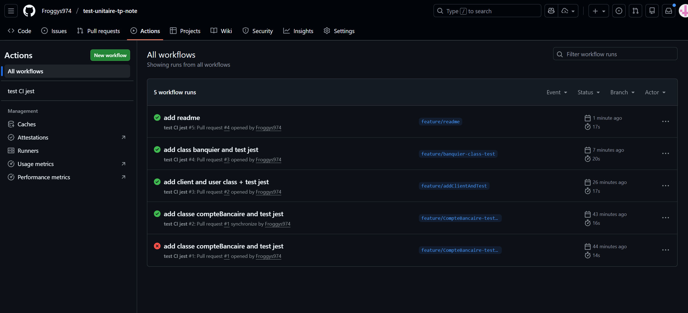

# Test Unitaire - TP Noté

Projet de tests unitaires avec Jest pour un système bancaire.
GitHub : [lien_vers_le_projet](https://github.com/Froggys974/CoursTestUnitaire)

## Installation

```bash
npm install
```

##  Lancer les tests

```bash
npm run test
```

## CI/CD

Le projet est configuré avec une intégration continue qui exécute automatiquement les tests à chaque push. Voir le fichier `.github/workflows/test-ci.yml` pour plus de détails.

